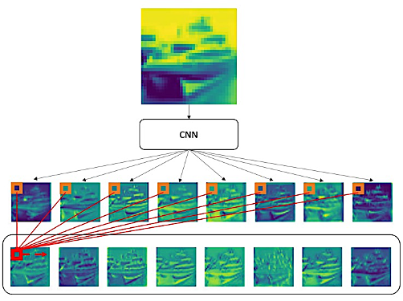
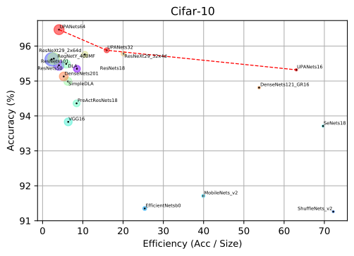
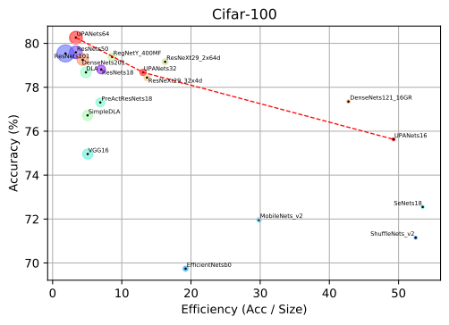

# UPANets
The implement code of UPANets: Learning from the Universal Pixel Attention Networks

## Abstract
Among image classification, skip and densely-connection-based networks have dominated most leaderboards. Recently, from the successful development of multi-head attention in natural language processing, it is sure that now is a time of either using a Transformer-like model or hybrid CNNs with attention. However, the former need a tremendous resource to train, and the latter is in the perfect balance in this direction. In this work, to make CNNs handle global and local information, we proposed UPANets, which equips channel-wise attention with a hybrid skip-densely-connection structure. Also, the extreme-connection structure makes UPANets robust with a smoother loss landscape. In experiments, UPANets surpassed most well-known and widely-used SOTAs with an accuracy of 96.47% in Cifar-10, 80.29% in Cifar-100, and 67.67% in Tiny Imagenet. Most importantly, these performances have high parameters efficiency and only trained in one customer-based GPU. We share implementing code of UPANets in here.

## Acknowledgement
This code was referring another project in [here](https://github.com/kuangliu/pytorch-cifar). 

## Highlight
UPANets has surpassed a series of SOTAs by reimplementing in the same enviroment and experiment setting. The performance in Cifar-10 and Cifar-100 can be seen in the following plots:

where accuracy is in 1 - top-1 error, and efficiency follows a equation in `Acc/Params`.

## Usage

### Prerequirement
There is a pre-defined package throught `pipenv` in `./Pipfile`. Please install the needed packages in:

`$ pipenv install` 

In this step, the `pipenv` will automatically get the **Pipfile.lock** and install the needed parameter or packages as the **Pipfile** content.

### Simple usage 
In this project, we implement UPANets in `./models/upanets.py`. The simple usage is:

`python main.py`

